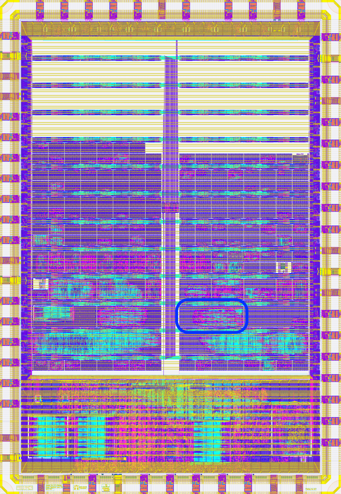
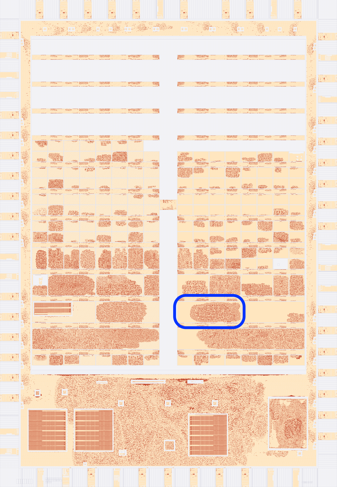

  

# Binarized Neural Network On-Chip at Telluride Neuromorphic Workshop'23

**"The Huge"** Binarized Neural Network On-Chip was developed during the [Telluride Neuromorphic Workshop 2023](https://sites.google.com/view/telluride-2023/home) as a project for the [OSN23: Open-Source Neuromorphic Hardware, Software and Wetware](https://sites.google.com/view/telluride-2023/topic-areas/osn23-open-source-neuromorphic-hardware-software-and-wetware) topic.

**NOTE: To our knowledge this is the first Telluride project that resulted in production of a physical silicon chip!**

## Design goals
The design goals behind this project:
1) place whole neural network on-chip in a brain inspired manner
2) take advantage of connection sparsity
3) eliminate communication with external memory (low power)
4) use [fully-open source](https://openroad.readthedocs.io/en/latest/) design process
5) **fabricate the actual silicon chip** for the final testing.

## Results
Sample neural network consisting of 40 neurons and 320 synapses fits in less than 1 square millimiter on [Sky130 nm](https://skywater-pdk.readthedocs.io/en/main/) process and uses less than 10K logic gates.

## ASIC tapeout

**"The Huge"** Binarized Neural Network On-Chip was tapedout on [FOSS 130nm Production process](https://skywater-pdk.readthedocs.io/en/main/) via [Tiny Tapeout](https://tinytapeout.com/runs/tt05/) initiative.

The project [#582](https://tinytapeout.com/runs/tt05/582/).

<p align="center" width="100%">
  
  
</p>

## 
The standalone test for a Binarized Leaky Integrate and Fire (BLIF) neuron can be found in [https://github.com/rejunity/tt04-LIF-neuron-telluride2023]([https://github.com/rejunity/tt04-LIF-neuron-telluride2023]) and it was tapedout with [Tiny Tapeout 4 / CI2309](https://tinytapeout.com/runs/tt05/) shuttle.

# The team
  - Dr. Paola Vitolo
  - Dr. Andrew Wabnitz
  - ReJ aka Renaldas Zioma

# Topic Leader and Tapeout Sponsor
  - [Prof. Jason Eshraghian](https://ncg.ucsc.edu/jason-eshraghian-bio/)


# History of optimisation from older to newer commit
#### 16 tiles
```
  * 25.88% 243085um  7918 cells 544 dff, 23.26 min gds, 13.55 viewer    <- 384 synapses (16) x 16 x 8
  * 40.98% 393467um 12384 cells 800 dff, 19.59 min gds,                 <- 640 synapses (16) x 16 x 16 x 8
  * 43.67% 432050um 12932 cells 928 dff, 29.0  min gds, 47.26 viewer    <- 640 synapses (16) x 16 x 16 x 8 fixed the weights
  * 45.23% 427921um 13795 cells 928 dff, 26.5  min gds                  <- 640 synapses (16) x 16 x 16 x 8 **BN added**
  * 17.09% 100777um  5116 cells 808 dff, 15.19 min gds                  <- 320 synapses (16) x 16 x 16 x 8 **50% sparsity!**
  * 24.72% 183035um  7957 cells 968 dff, 13.22 min gds                  <- 320 synapses (16) x 16 x 16 x 8 **BN scale per neuron**, 50% sparsity!
```
#### 8 tiles
```
  * 49.81%, 185466um 7977 cells 968 dff, 15.45 min gds                  <- 320 synapses (16) x 16 x 16 x 8 BN scale per neuron, 50% sparsity!
  * 59.47%, 233359um 9486 cells 1128dff, 16.30 min gds                  <- 320 synapses (16) x 16 x 16 x 8 **BN scale+add** per neuron, 50% sparsity!
  * 62.84%, 213588um 9624 cells 1142dff, 15.42 min gds                  <- 320 synapses (16) x 16 x 16 x 8 **threshollds** per layer, BN per neuron, 50% sparsity!
```

# What is Tiny Tapeout?

TinyTapeout is an educational project that aims to make it easier and cheaper than ever to get your digital designs manufactured on a real chip.

To learn more and get started, visit https://tinytapeout.com.

## Resources

- [FAQ](https://tinytapeout.com/faq/)
- [Digital design lessons](https://tinytapeout.com/digital_design/)
- [Learn how semiconductors work](https://tinytapeout.com/siliwiz/)
- [Join the community](https://discord.gg/rPK2nSjxy8)
